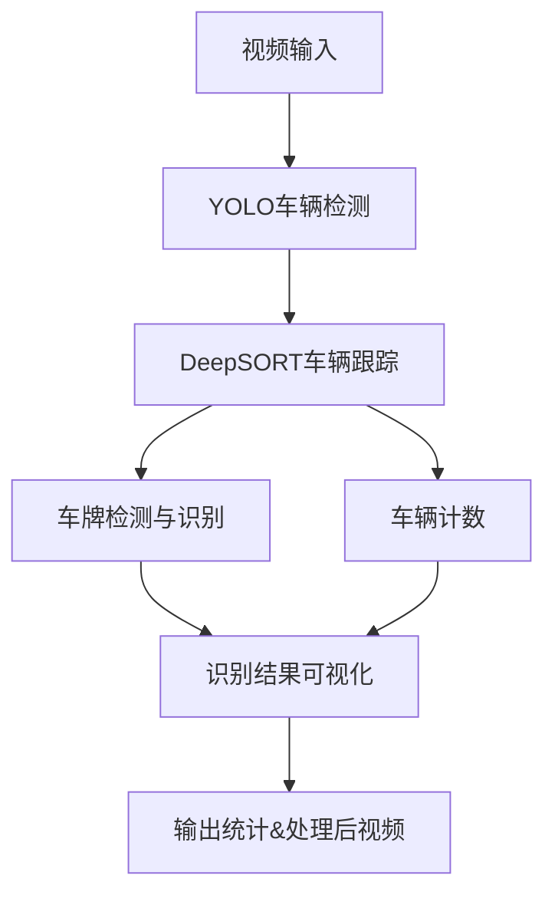

# Dynamic Vehicle Detection and Counting System

本项目实现了一个**基于深度学习的动态车辆监测计数系统**，可对城市道路车流量进行实时监控与统计。系统支持车辆检测、跟踪、车牌识别，以及单位时间内车流量自动统计，为智能交通管理和路况分析提供数据支撑。

---

## 目录

- [功能简介](#功能简介)
- [技术栈](#技术栈)
- [数据集](#数据集)
- [系统架构](#系统架构)
- [快速开始](#快速开始)
  - [1. 环境准备](#1-环境准备)
  - [2. 数据准备](#2-数据准备)
  - [3. 车牌识别模块说明](#3-车牌识别模块说明)
  - [4. 运行主程序](#4-运行主程序)
  - [5. 主要模块说明](#5-主要模块说明)
  - [6. 输出内容](#6-输出内容)
- [参考资料](#参考资料)
- [联系方式](#联系方式)
- [免责声明](#免责声明)

---

## 功能简介

- **车辆目标检测**  
  利用 YOLO 系列模型（如 YOLOv5、YOLOv8）对视频流中的车辆进行高效检测。

- **车辆跟踪与计数**  
  集成 DeepSORT 算法，实现车辆跨帧跟踪与 ID 分配，并在指定区域（如虚拟计数线/区域）自动计数。

- **车牌识别**  
  支持基于 YOLO2/YOLO3 与 CRNN 模型进行车牌检测与字符识别，或集成 `utils` 目录下的预训练检测模块，按需灵活集成。

- **可视化与统计**  
  在视频中实时标记每辆车的位置、跟踪 ID 和车牌号，并输出单位时间内的流量统计。

---

## 技术栈

- Python 3.x
- PyTorch（深度学习框架）
- YOLO 系列（车辆检测）
- DeepSORT（多目标跟踪）
- OpenCV（视频处理与可视化）
- Numpy（数据处理）
- 其它深度学习相关技术

---

## 数据集

- **AIC-HCMC-2020**  
  [AIC-HCMC-2020 数据集介绍](https://www.aicitychallenge.org/2020-data-set/)  
  包含城市道路多类型车辆的视频及标注，适合本项目目标检测与计数任务。

---

## 系统架构

## 快速开始
  
###  1. 环境准备
建议使用虚拟环境，确保依赖库版本一致：

python -m venv vehicle_count_env
source vehicle_count_env/bin/activate  # Windows 用户请用 vehicle_count_env\Scripts\activate
pip install torch torchvision numpy opencv-python yolov5 deep_sort_realtime

### 2. 数据准备
下载并解压 AIC-HCMC-2020 数据集 至 ./data/ 目录。
准备测试视频，重命名为 test_video.mp4，放在 ./data/ 目录下。

### 3. 车牌识别模块说明
车牌识别模块可采用 model 目录下自训练的 YOLO2/YOLO3+CRNN 模型，或直接集成 utils 目录下的预训练检测模块，根据项目需求灵活选择并配置。

###  4. 运行主程序
运行主程序detector_counter_liscense_vechicle.py，可根据实际需求调整参数(config.yaml)：

python video_analysis_test.py --video ./data/test_video.mp4 --output ./results/output.mp4...(video_analysis_test.py底部)
更多参数说明请参考代码底部或帮助文档。

###  5. 主要模块说明
模块文件	功能描述

deepsort_tracker.py	DeepSORT 多目标跟踪与 ID 分配
license_plate_detector.py	车牌定位与字符识别（支持自训练或集成预训练模块）
traffic_counter.py	车辆过线（区域）计数逻辑

###  6. 输出内容
可视化视频：每帧展示检测框、跟踪 ID、车牌号等信息，输出至 ./results/output.mp4
流量统计文件：如 flow_count.csv，记录各时间段车流量统计信息
日志输出：终端实时输出统计信息

## 参考资料
YOLO 官方文档
DeepSORT 论文及实现
AIC-HCMC-2020 数据集

## 联系方式
如有疑问或合作意向，欢迎联系：

Email: dontlike299@gmail.com

##  免责声明
本项目仅供学术交流与学习使用，禁止用于任何商业用途。请遵守相关法律法规，尊重数据隐私与版权。

# 补充
车牌识别模块可使用提供的yolo2,yolo3和CRNN自训练实现，也可使用license_plate_detector.py的预训练模型(自己整合到检测分析主系统里)
**如有其他定制需求或内容细化，欢迎继续提出！**
